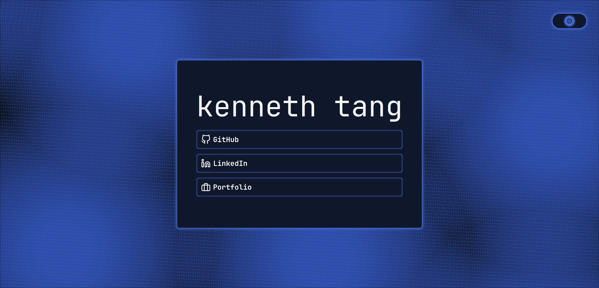

# hello



  

This is the repository containing the source code for my landing page at [hello.kennethtang.org](https://hello.kennethtang.org).

Built with


Deployed on


## Build

```bash
npm install
npm run build
```
