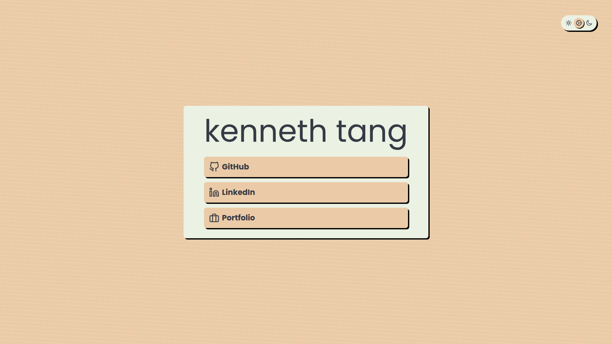

# :wave: hello

  



This is the repository containing the source code for my landing page at [hello.kntng.dev](https://hello.kntng.dev).

Built with


Deployed on


## Build

```bash
bun install
bun run build
```
